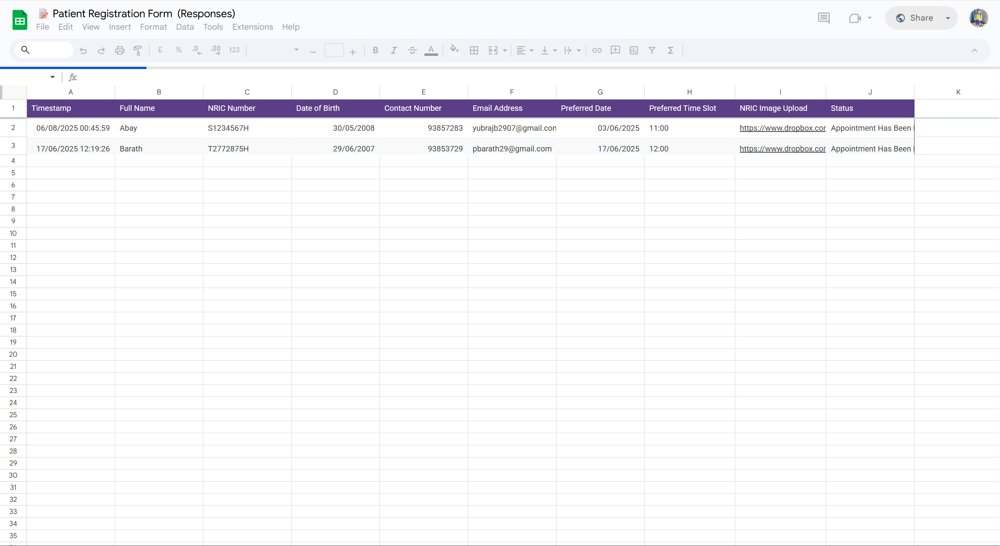
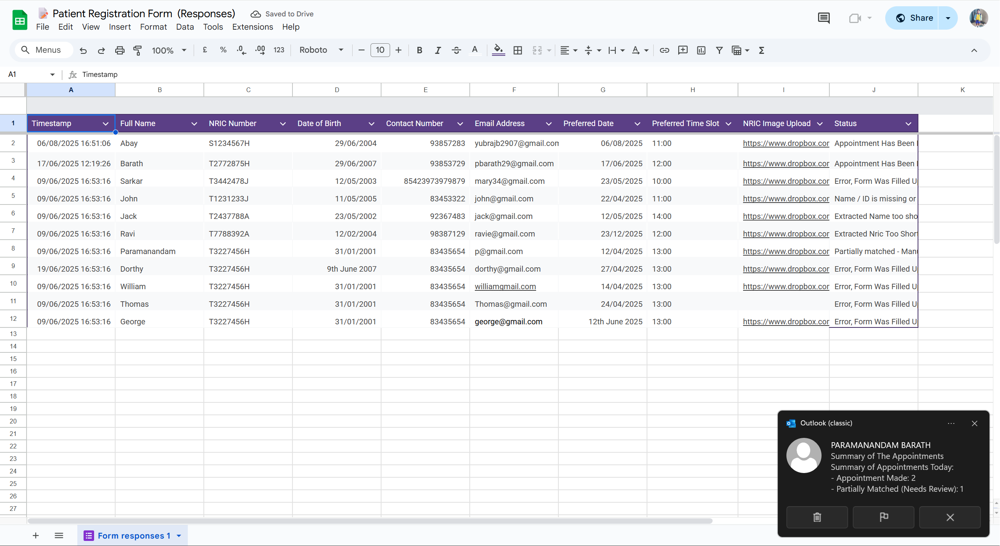
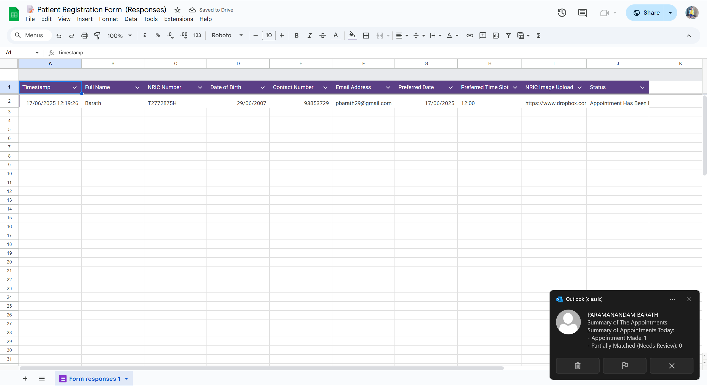

# Medical Appointment Automation Bot

A UiPath RPA project that automates the full patient appointment booking pipeline for a healthcare clinic. From reading a Google Form submission to sending a signed confirmation PDF by email, the bot handles everything without any human input in between.

I built this to solve a pretty real problem: clinic staff were manually going through form responses, checking NRIC images, booking slots on a website, and emailing patients one by one. This bot replaces that entire loop.

---

## What It Does

When a patient fills out the Google Form, the bot:

1. Reads the new responses from Google Sheets
2. Validates all the fields (date format, Singapore contact number, email, etc.)
3. Downloads the NRIC image the patient uploaded and runs OCR on it
4. Extracts the name and NRIC number from the OCR output using regex
5. Compares the extracted details against what the patient typed in the form
6. Checks the local patient Excel database for a match
7. If it's a new patient, adds them to the database
8. Opens Chrome and books the appointment on the clinic website
9. If the preferred date or time slot is taken, it automatically tries the next available one
10. Generates a Word-based appointment letter and exports it as a signed PDF
11. Emails the patient their signed appointment confirmation
12. Sends an admin summary email with stats for the batch run
13. Updates the Google Sheet status column for every row processed

---

## The Part I Found Most Interesting

The NRIC verification step is probably the most interesting part technically. The bot does not just trust what the patient typed. It downloads the image they submitted, runs OCR to read the card, cleans the raw text output, and then uses regex to pull out the name and ID number independently. Only if both match what was in the form does it proceed with booking.

This felt like a small but real identity verification pipeline, and getting the OCR output to be clean enough for reliable regex matching took a fair bit of iteration since the text extraction is messy at the edges.

The adaptive scheduling was also interesting to build. Rather than failing when a slot is unavailable, the bot increments the date by one day or the time by 30 minutes and retries. It loops until it finds something free. This kind of fallback decision loop is something I want to explore more in more complex systems.

---

## Pipeline Overview

```
Google Form Submission
        |
        v
Read Google Sheets (UiPath GSuite)
        |
        v
Validate Fields (format, length, regex)
        |
        v
Download NRIC Image (HTTP)
        |
        v
OCR Extraction (Google OCR Engine)
        |
        v
Regex Parsing + Cross-validation
        |
        v
Patient DB Lookup / Update (Excel)
        |
        v
Web Automation - Book Appointment (Chrome)
        |
        v
Retry Logic if Slot Unavailable
        |
        v
Generate Appointment PDF (Word + iTextSharp)
        |
        v
Email Patient + Admin Summary (Outlook)
        |
        v
Update Status in Google Sheet
```

---

## Screenshots

### Google Sheet with Form Responses and Bot Status Output

The bot writes back to column J with a status for each row. This includes successful bookings, partial matches that need manual review, and specific error codes for things like bad date formats or OCR failures.



### Batch Run with Multiple Patients and Mixed Results

This shows the bot handling a batch with different outcomes per row. You can see statuses like "Appointment Has Been Confirmed", "Error, Form Was Filled Up Wrongly", "Extracted Name Too Short", and "Partially Matched - Manual Review".



### Admin Summary Email Notification

After each batch run, the bot sends an Outlook email to the admin with a count of confirmed appointments, partial matches, and errors.



### UiPath Orchestrator Job History

The bot was deployed and run through UiPath Orchestrator. This shows 13 job executions with a mix of successful and faulted runs from development testing.


### OAuth App Registration (Google Sheets Integration)

The Google Sheets connection is set up using a confidential OAuth app registered in UiPath Orchestrator for secure API access.


---

## Tech Stack

| Component | Tool/Library |
|---|---|
| Automation Engine | UiPath Studio 25.0 |
| OCR | Google OCR Engine (via UiPath OCR Activities) |
| Google Sheets | UiPath GSuite Activities 3.1.21 |
| Web Automation | UiPath UIAutomation 25.10.7 (Chrome) |
| Document Generation | UiPath Word + PDF Activities |
| Digital Signature | iTextSharp.netstandard 5.5.13.2 |
| Patient Database | Microsoft Excel (local) |
| Email | UiPath Mail Activities (Outlook) |
| Deployment | UiPath Orchestrator (Cloud) |
| Expression Language | Visual Basic |

---

## Project Structure

```
RPA-main/
├── Main.xaml                      # Main UiPath workflow
├── project.json                   # Project config and dependencies
├── AppointmentTemplate.docx       # Word template for appointment letters
├── PatientDatabase.xlsx           # Local patient records database
├── Appointments/                  # Output folder for generated PDFs
│   ├── Appointment_APT-860238.pdf
│   └── Appointment_APT-860238signed.pdf
├── Nric Images/                   # Downloaded NRIC images for OCR
├── ScreenShots/                   # Audit trail screenshots
└── Orchestrator Evidence/         # Orchestrator deployment evidence
```

---

## Error Handling

Each stage has its own try-catch block. If something fails (OCR, regex, web automation, etc.), the bot logs a specific error message to the Google Sheet status column and moves on to the next row instead of crashing entirely. This was important to make the batch runs reliable.

Status codes written to the sheet:
- `Appointment Has Been Confirmed` - full success
- `Partially Matched - Manual Review` - OCR and form data did not match exactly
- `Error, Form Was Filled Up Wrongly` - validation failed
- `OCR Failed [exception]` - image could not be read
- `Image Does Not Contain Necessary Details` - OCR output missing name or ID
- `Extracted Name Too Short` - OCR result was too short to be reliable
- `Error With Token Number` - appointment booking succeeded but token extraction failed
- `Name / ID Is Missing or Does Not Match` - cross-validation failed

---

## What I Would Improve

A few things I would change if I were to redo this:

- Replace the local Excel database with a proper database (SQLite or PostgreSQL) so it is not machine-dependent
- Parameterize all file paths so the project is portable across machines
- Add a confidence threshold to the OCR step, since some images are blurry and the extracted text is unreliable even when the regex technically matches
- The retry logic for date/time scheduling could be smarter. Right now it increments blindly. A better version would query available slots first and pick optimally
- Build a simple web dashboard to view booking statuses instead of relying on the Google Sheet column

---

## Dependencies (from project.json)

```
UiPath.System.Activities 25.4.4
UiPath.UIAutomation.Activities 25.10.7
UiPath.Excel.Activities 3.1.1
UiPath.Mail.Activities 2.2.10
UiPath.GSuite.Activities 3.1.21
UiPath.Word.Activities 2.2.0
UiPath.PDF.Activities 3.22.1
UiPath.OCR.Activities (Google OCR Engine)
iTextSharp.netstandard 5.5.13.2
UiPath.WebAPI.Activities 1.21.1
UiPath.IntegrationService.Activities 1.15.0
UiPath.MicrosoftOffice365.Activities 3.2.10
```
